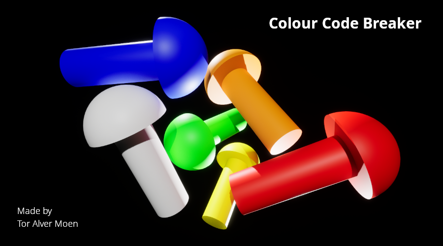
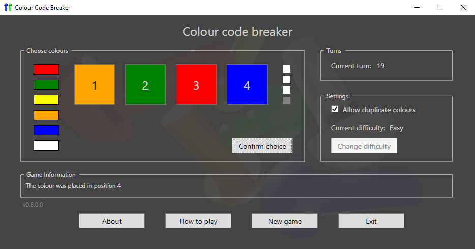

The original version of this app started as a possible puzzle to be included in another game, but it quickly took on a life of its own and became the original Code Breaker app.

There are many weaknesses in that version, and one of the biggest is that you can't edit the colour code during input, so I decided to make an upgraded version that addressed the issues from the original.

One thing I have not done yet is a history view that can display all players' guesses in a game. This is a possible future update for this version.

---

This version was made in C# WPF with [Visual Studio Community](https://visualstudio.microsoft.com/) for the app itself. The splash screen and window background images, as well as the icon, were created using [Blender](https://www.blender.org/) for the 3D models and [Unreal Engine 5](https://www.unrealengine.com/) for the materials and rendering.

#### Screenshot:

