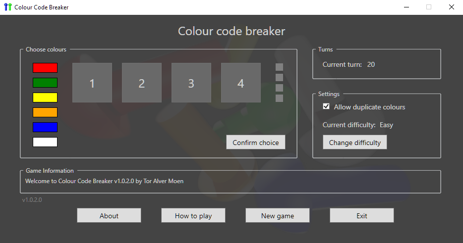

The original version of this app started as a potential puzzle to be included in another game, but it quickly took on a life of its own and became the original Code Breaker app.

There are many weaknesses in that version, and one of the biggest is that you can't edit the color code during input. So, I decided to create an upgraded version that addresses the issues from the original.

One thing I have not done yet is a history view that can display all the player's guesses in a game. This is a possible future update.

---

This version was made in C# WPF with [Visual Studio Community](https://visualstudio.microsoft.com/) for the app itself. The splash screen and window background images, as well as the icon, were created using [Blender](https://www.blender.org/) for the 3D models and [Unreal Engine 5](https://www.unrealengine.com/) for the materials and rendering and also [GIMP - GNU Image Manipulation Program](https://www.gimp.org) for finalizing graphical elements.

#### Screenshot:

